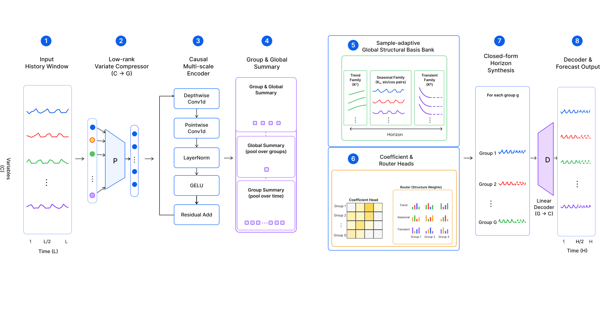

# A Lightweight Deep Learning Model Based on Basis Synthesis for Long-Term Time Series Forecasting

[](https://www.python.org/)
[](https://pytorch.org/)

이 저장소는 장기 시계열 예측(Long-Term Time-Series Forecasting, LTSF)을 위한 **초경량 제안 모델(Proposed Model, `Ours`)**의 공식 구현체 및 비교 실험 환경을 제공합니다. 

본 연구의 핵심 질문은 다음과 같습니다: **"거대 트랜스포머 기반 모델들이 사용하는 파라미터의 극히 일부만으로도, 경쟁력 있는 시계열 예측 성능을 달성할 수 있는가?"**

단순히 가장 낮은 오차를 내는 무거운 모델을 찾는 것을 넘어, 제한된 파라미터 환경에서도 우수한 성능을 입증하는 **Parameter-Efficiency(파라미터 효율성)**와 예측 근거를 제공하는 **Structural Interpretability(구조적 해석 가능성)**에 집중합니다.

---

## About Our Model

PatchTST와 같은 최신 거대 모델들은 훌륭한 정확도를 보여주지만, 파라미터 수가 수백만~수천만에 달하여 실제 환경에서의 추론 비용과 메모리 부담이 큽니다. 제안 모델(`Ours`)은 파라미터 크기를 약 **11K 수준**으로 줄이면서도 대형 모델에 준하는 성능을 낼 수 있도록 설계되었습니다.

### 핵심 아키텍처 (Key Architecture Components)



1. **Causal Multi-Scale Encoder**
   - 무거운 Attention 레이어 대신 **Causal Depthwise-Separable Convolution**과 다양한 크기의 **Dilation**을 적용했습니다.
   - 이를 통해 매우 적은 파라미터로도 시계열 데이터 내의 단기 및 장기 다중 스케일 패턴을 효과적으로 추출합니다.

2. **Structural Forecast Basis (구조적 예측 기저)**
   - 미래의 값을 직접 점추정(Direct Head)하는 대신, 예측값을 의미 있는 3가지 구조적 요소로 분해하여 조합합니다.
   - **Trend Branch:** 다항식 및 감쇠(Damped) 형태의 전반적인 추세 성장/감소를 포착합니다.
   - **Seasonal Branch:** 적응형 주파수 및 위상 변이(Phase Shift)를 통해 주기적 변동성을 포착합니다.
   - **Transient Branch:** 단기적으로 발생하여 빠르게 소멸하는 일시적 신호를 포착합니다.

3. **Adaptive Basis Bank & Router**
   - **Adaptive Bank:** 입력된 시계열 윈도우의 요약된 특징(Summary)을 바탕으로, 감쇠율(Decay Rate)이나 주파수(Frequency) 등을 고정하지 않고 샘플에 맞게 동적으로 조정합니다.
   - **Router Mechanism:** 입력 패턴에 따라 Trend, Seasonal, Transient 각 브랜치의 반영 비율을 동적으로 조절(Weighting)하여 유연한 예측을 수행합니다.

---

## Key Results & Benchmarks

본 연구는 단순히 정확도 1위를 찾는 것을 넘어, **2% Efficient Winner**(최고 정확도 모델 대비 오차 2% 이내이면서 파라미터가 가장 적은 모델)를 함께 평가합니다. 

*(아래 결과는 `configs/benchmarks/benchmark_manifest.ours_main.json` 기준 평균(Seed 42, 43, 44) 테스트 결과입니다.)*

| Dataset | Lookback | Horizon | Accuracy Winner | 2% Efficient Winner | Insight |
| :--- | :---: | :---: | :--- | :--- | :--- |
| **ETTh1** | 96 | 96 | `ours` (0.2179 / **11.1K**) | `ours_direct_head` (0.2191 / 10.7K) | 제안 모델이 정확도와 경량성을 모두 확보 |
| **ETTh1** | 96 | 192 | `dlinear` (0.2407 / 37.2K) | `ours_direct_head` (0.2423 / 16.9K) | 오차 +0.67% 방어, 파라미터 **54.5% 절감** |
| **ETTh1** | 96 | 336 | `dlinear` (0.2520 / 65.2K) | `dlinear` (0.2520 / 65.2K) | (해당 조건은 DLinear 강세) |
| **ETTh1** | 96 | 720 | `patchtst` (0.2930 / 10.7M) | **`ours`** (0.2945 / **11.1K**) | **오차 +0.50% 방어, 파라미터 약 963배 절감** |
| **ETTm2** | 384 | *all* | `dlinear` | `dlinear` | ETTm2 전반에선 DLinear가 우세 (본 모델의 한계점) |

**주요 시사점 (Takeaways):**
- **ETTh1 장기 예측(Horizon 720):** `PatchTST`가 가장 낮은 오차를 보였으나, 제안 모델(`Ours`)은 그와 불과 0.5% 이내의 오차를 유지하면서 파라미터 수를 **약 963배** 줄이는 데 성공했습니다.
- **ETTm2 한계점:** ETTm2 데이터셋에서는 DLinear 모델이 명확히 강세를 보이며, 본 논문은 제안 모델이 모든 데이터셋을 지배한다고 주장하지 않고 정확도-파라미터 효율 간의 Trade-off 개선에 집중함을 명확히 합니다.

---

## Repository Structure

```text
.
├── configs/
│   ├── benchmarks/       # 재현용 주 실험 매니페스트 파일들
│   ├── model_presets/    # 모델별 기본 하이퍼파라미터 설정
│   └── sweeps/           # Ablation 및 Hyperparameter Sweep 매니페스트
├── docs/assets/          # README 및 논문에 사용되는 다이어그램 에셋
├── ml/
│   ├── scripts/          # 학습, 벤치마크 실행, 리포트 생성 스크립트
│   │   └── models/       # ours, patchtst, dlinear, gru 등 구현체
│   └── tests/            # PyTest 유닛 테스트
├── reports/results/      # 요약된 실험 결과 CSV (GitHub 업로드용)
└── tools/                # 데이터 준비 및 보고서 보조 스크립트
```
*(참고: 용량이 큰 원본 `dataset/`, 전체 실험 결과 `runs/`, 가상환경 `.venv/` 등은 `.gitignore` 처리되어 저장소에 포함되지 않습니다.)*

---

## Getting Started

### 1. Environment Setup
가상환경을 세팅하고 패키지를 설치합니다.
```powershell
.\.venv\Scripts\python.exe -m pip install -r requirements.txt
```

### 2. Dataset Preparation
Manifest 파일 내 상대 경로를 맞추기 위해, 아래와 같은 구조로 데이터셋을 배치해야 합니다.
- `dataset/ETT-small/ETTh1.csv`
- `dataset/ETT-small/ETTm2.csv`
- `dataset/electricity/electricity.csv`
- `dataset/traffic/traffic.csv`

### 3. Run Benchmark
전체 Main 벤치마크 재현을 위한 명령어입니다:
```powershell
.\.venv\Scripts\python.exe ml\scripts\run_benchmark_manifest.py `
  --manifest-path configs\benchmarks\benchmark_manifest.ours_main.json `
  --results-dir runs\ours_main_repro
```

Ours 그룹 크기 등 특정 Sweep 실행:
```powershell
.\.venv\Scripts\python.exe ml\scripts\run_ours_sweep_manifest.py `
  --manifest-path configs\sweeps\benchmark_manifest.ours_group_size_sweep.json `
  --results-dir runs\ours_group_size_sweep
```

### 4. Build Report
실험 완료 후 결과 요약 CSV 및 마크다운 리포트를 생성합니다:
```powershell
.\.venv\Scripts\python.exe ml\scripts\build_benchmark_report.py --results-dir runs\ours_main_repro
.\.venv\Scripts\python.exe tools\reporting\write_etth1_md.py
```

### 5. Run Tests
전체 코드가 올바르게 작동하는지 확인합니다:
```powershell
.\.venv\Scripts\python.exe -m pytest ml\tests -q
```
